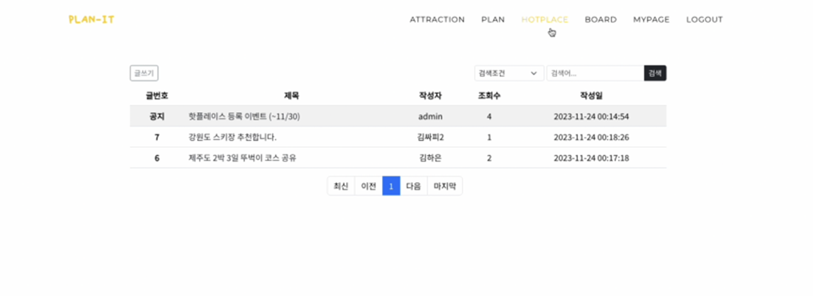
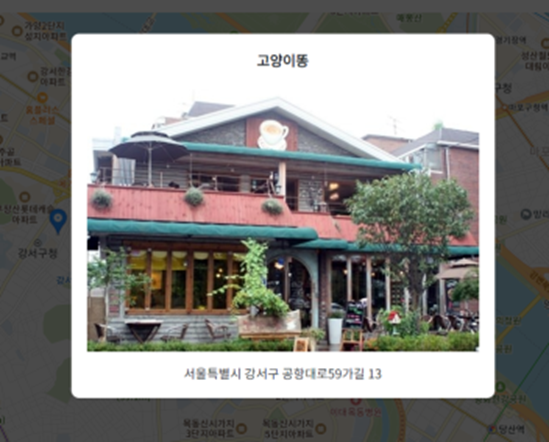
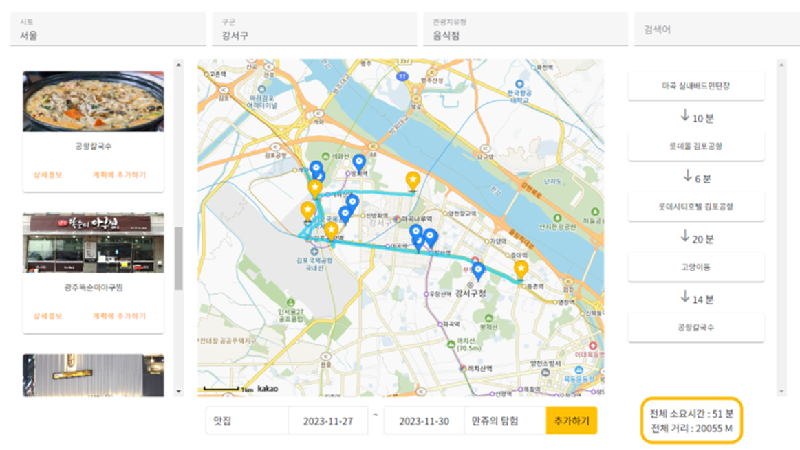
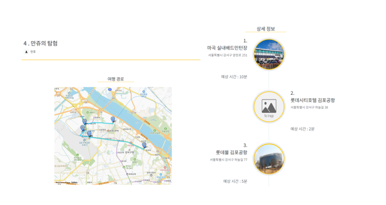
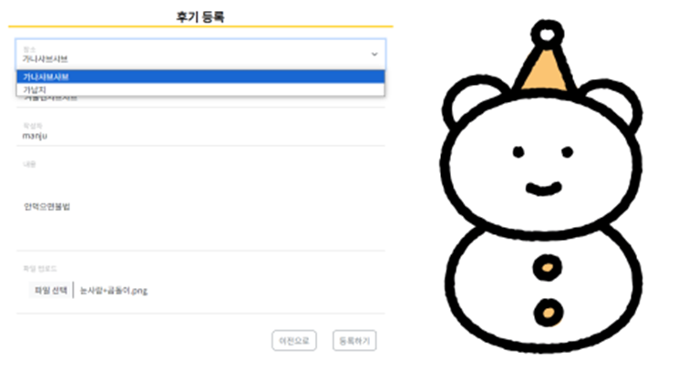
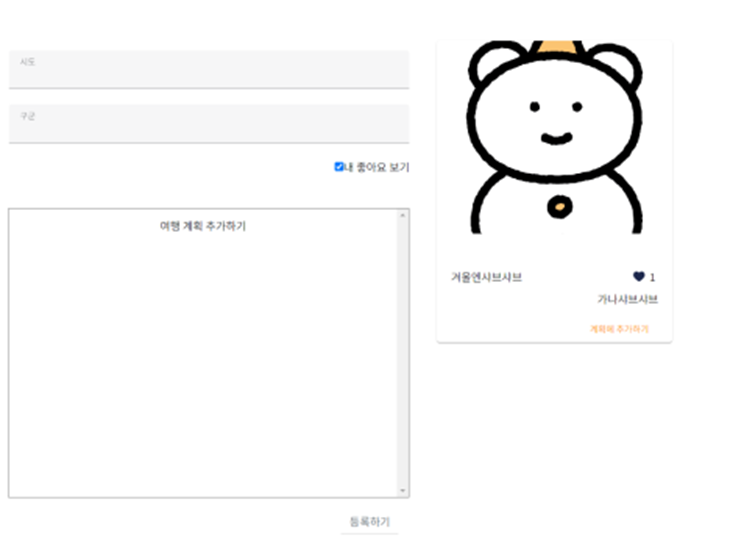
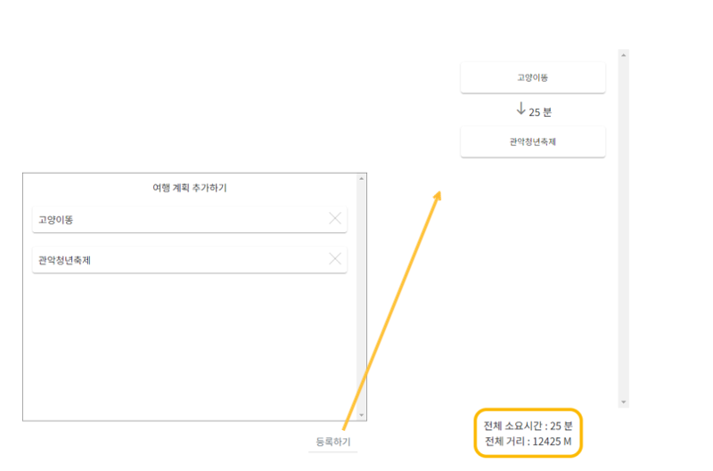

# :beach_with_umbrella: : PLAN_IT

## :person_frowning: 팀원

- 이민주
- 김하은

| 필수 기능 |  |
| -------- | ------------------ |
| 게시판 기능 | :white_check_mark: |
| 메인페이지 화면 | :white_check_mark: |
| 회원관리 기능 | :white_check_mark: |
| 관광지 조회 기능 | :white_check_mark: |

| 추가 기능 |  |
| -------- | ------------------ |
| 여행 계획 기능 | :white_check_mark: |
| 핫플레이스 기능 | :white_check_mark: |
| 관리자 화면 | :white_check_mark: |

## ⚒️ 화면 구성
### 1. 메인 페이지
- 메인 페이지입니다. 상단의 메뉴는 현재 로그인 상태, 사용자 권한에 따라 다르게 출력됩니다.    
 

- 등록된 핫플레이스 중 좋아요 기준으로 상위 6개 관광지가 메인 화면에 출력됩니다.  

### 2. 회원 기능
- 로그인 화면 입니다.  

- 회원가입 화면입니다.  

- 로그인 후 마이페이지에서 자신의 정보를 조회하고 수정할 수 있습니다.  

- 관리자 계정으로 로그인했다면 ADMIN 메뉴에서 전체 회원 정보를 조회하고 수정할 수 있습니다.  

### 3. 게시판 기능
- 자유게시판에서 게시글을 작성할 수 있습니다.  

- 전체 게시글을 조회할 수 있습니다. 이때 관리자 계정이 작성한 글은 자동으로 공지사항으로 상단에 고정됩니다.  

- 키워드를 통해 게시글을 검색할 수 있습니다.  

- 게시글 상세 조회 화면입니다.  

### 4. 관광지 조회 기능
- 관광지 조회 화면입니다. 지역별 및 유형별로 관광지를 조회할 수 있습니다.
- 조회된 관광지를 클릭하면 해당 위치로 지도가 이동합니다.  

- 모달창을 통한 상세 정보 보기가 가능합니다.  

### 5. 여행 계획 기능
- 조회된 관광지를 기반으로 여행 계획을 등록할 수 있습니다.
- 계획에 추가한 관광지를 실시간으로 확인할 수 있으며 드래그를 통한 순서 변경, 삭제, 추가가 가능합니다.
- 계획에 등록된 관광지가 변경될 때마다 동적으로 추천 경로와 예상 시간, 거리가 출력됩니다.  

- 전체 여행 계획 조회 화면입니다. 키워드를 통한 검색, 내가 작성한 계획만 모아서 조회할 수 있습니다.  

- 여행 계획 상세 조회 화면입니다. 저장된 관광지에 대한 경로와 상세정보를 확인할 수 있습니다.  

### 6. 핫플레이스 기능
- 여행 계획 상세 조회 화면에서 핫플레이스 등록 버튼을 통해 계획에 포함된 관광지 중 하나를 핫플레이스로 등록할 수 있습니다.  

- 핫플레이스 전체 조회 화면입니다. 작성자가 등록한 이미지를 기준으로 썸네일 형식의 리스트를 확인할 수 있습니다.  

- 핫플레이스 상세 조회 화면입니다. 마음에 드는 관광지는 좋아요 버튼을 누를 수 있습니다. 이때 좋아요는 중복으로 반영되지 않습니다.  

- 지역별로 등록된 핫플레이스와 내가 좋아요를 누른 핫플레이스를 조회할 수 있습니다.  

- 등록된 핫플레이스 중 사용자가 추가한 핫플레이스를 사용하여 여행 계획을 등록할 수 있습니다.  

## ⚒️ 시스템 구성
### ERD
---

### 클래스 다이어그램
---

